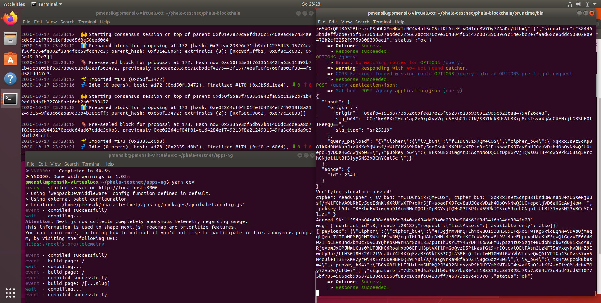
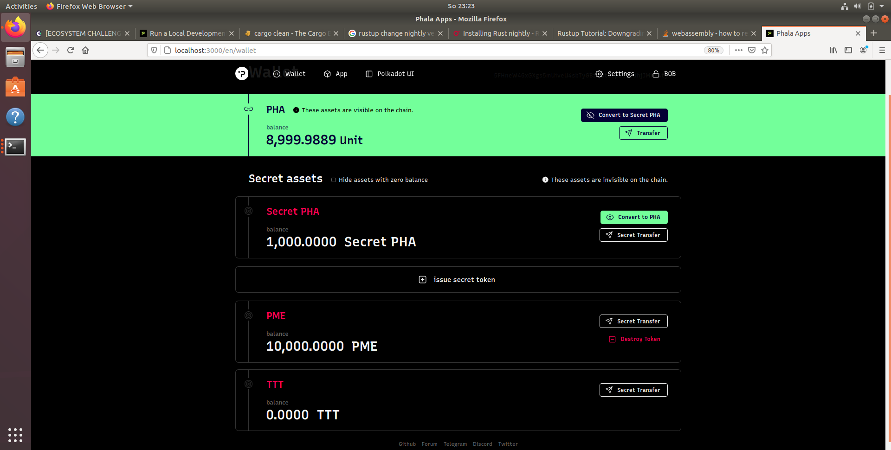

# [ECOSYSTEM CHALLENGE] (Beginner) Build and Run a Local Phala Network

1. Screenshot of running terminal windows (sorry, I was too lazy to install Terminar or tmux to the VM :-)

                                                                                                                                     
                                                                                                                                                
2. Phala wallet with tokens

3. My feeling on the Twitter :)
[Click to see the tweet](http://twitter.com/Polkadotters1/status/1317579904498663425?s=20).
